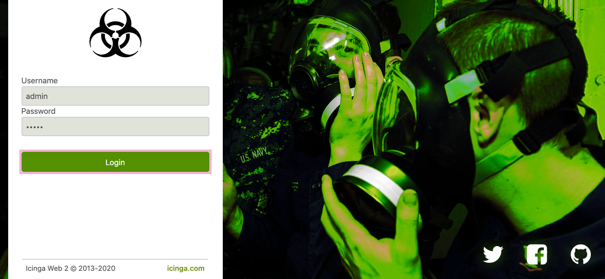
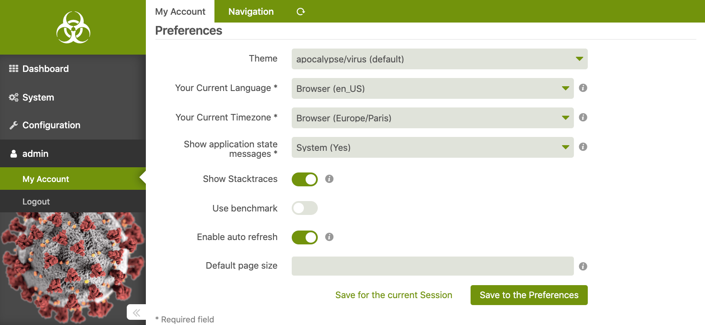
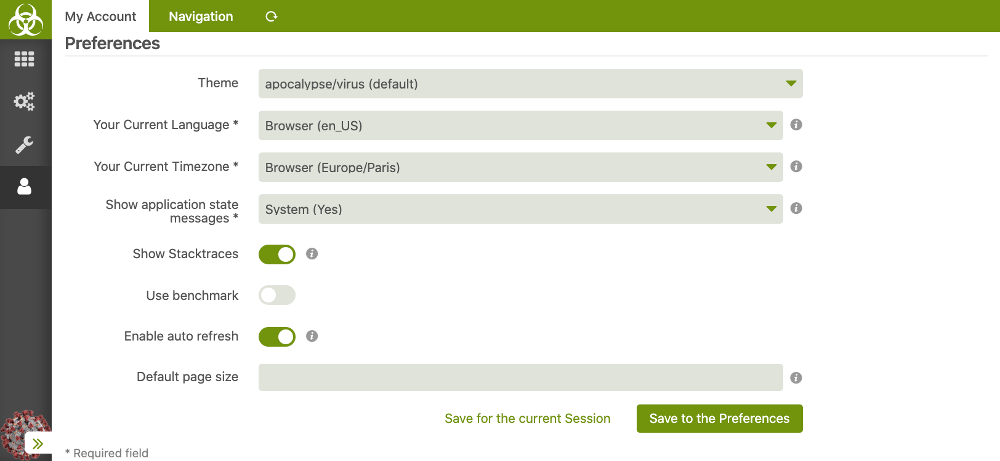
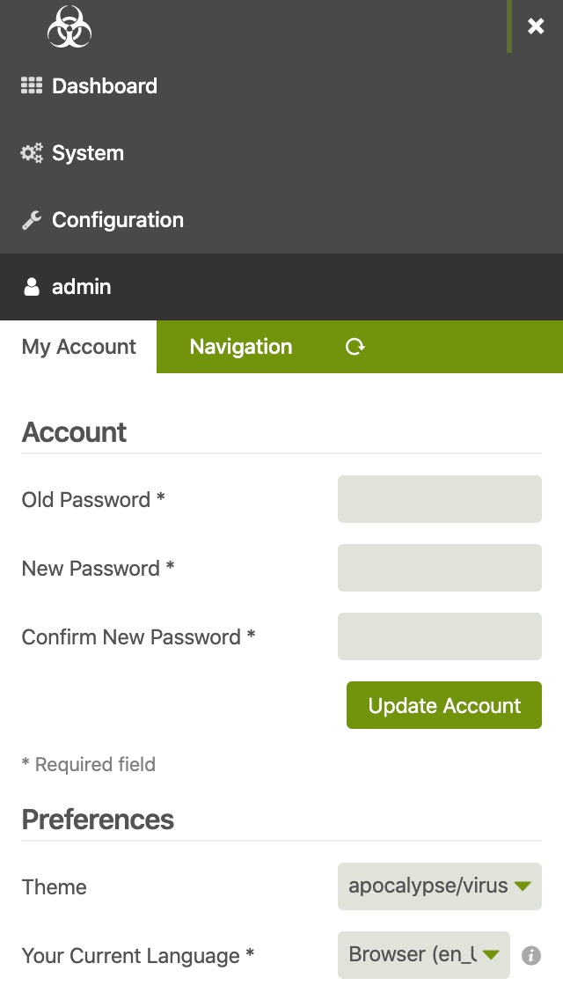

## Apocalyptic theme for [Icinga Web 2]

Background photo: [U.S. Navy]

### How to install

Save and enable as any other theme:

1. `git clone https://github.com/Al2Klimov/icingaweb2-theme-apocalypse.git /usr/share/icingaweb2/modules/apocalypse`
2. `icingacli module enable apocalypse`
3. Navigate to the settings as needed and set the theme to "apocalypse/virus":
    * Configuration / Application / Default Theme
    * My Account / Preferences / Theme

### Screenshots

Background photo: [CDC]

[Icinga Web 2]: https://github.com/Icinga/icingaweb2
[U.S. Navy]: https://www.flickr.com/photos/usnavy/8576451249
[CDC]: https://commons.wikimedia.org/wiki/File:SARS-CoV-2_without_background.png
